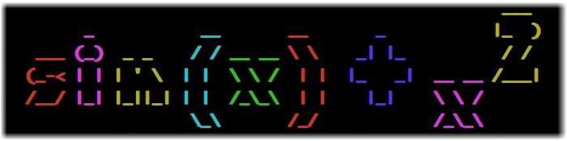

## <b>ppm</b> is a console-based pretty printer for mathematics



### Usage

ppm <b>input</b>

Like:

`ppm "x + 3"`

### Fonts and Colors

ppm supports a number of different fonts (see the full list with `ppm --help`). Color can either be alternating (the default), or grouped. The `--no-random` flag disables random colors.

Example:

`ppm --font ivrit --color grouped "tan(y) / x"`


### Building

```
 mkdir build
 cd build
 cmake ..
 make
```

### Running Examples

```
 cd ..
 cp build/project/ppm .
 sh examples.sh
```
